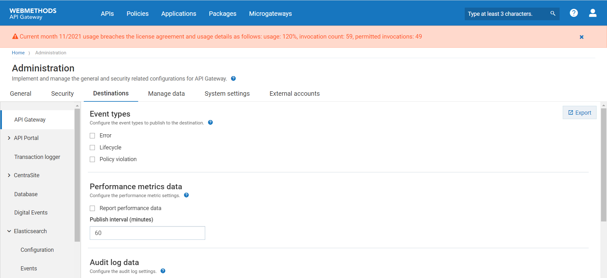
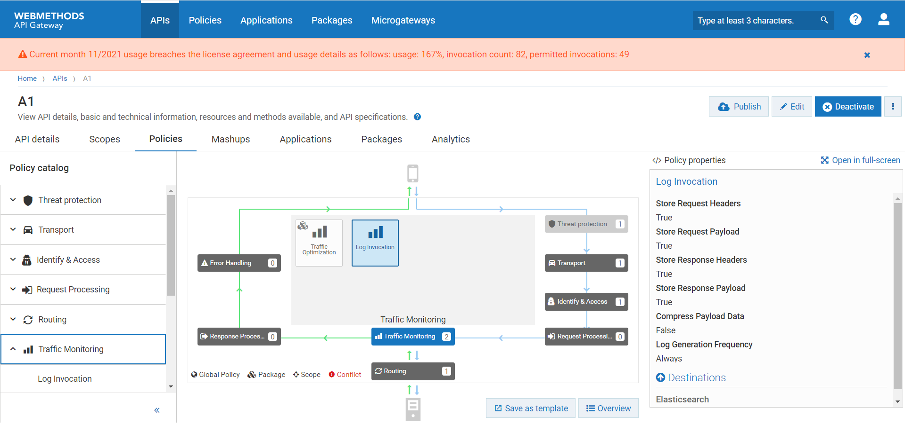

Overview
--------

API Gateway uses Elasticsearch as its primary data store to persist different types of assets such as APIs, Policies, Applications and runtime events and metrics. By default all the assets stored in the default Elasticsearch. But you can configure API Gateway to use an external Elasticsearch to store the API Gateway assets. For information about the Elasticsearch and Kibana versions that are compatible with your API Gateway version, see API Gateway, Elasticsearch, Kibana Compatibility Matrix.

Component compatibility matrix
=================================
The table below lists the Elasticsearch versions and corresponding Kibana versions compatible with your API Gateway version:

| API Gateway version| Compatible Elasticsearch versions                  | Compatible Kibana version |
| ------------------ | -------------------------------------------------- | ------------------------- |
| 10.11              | 7.13.0                                             | 7.13.0                    | 
| 10.7               | 7.7                                                | 7.7                       | 
| 10.5               | 7.2.0                                              | 7.2.0                     | 
| 10.4               | 5.6.4, 2.3.2                                       | 5.6.x, 4.5.x              | 
| 10.3               | 5.6.4, 2.3.2                                       | 5.6.x, 4.5.x              |
| 10.2               | 5.6.4, 2.3.2                                       | 5.6.x, 4.5.x              | 
| 10.1               | 2.3.2                                              | 4.5.x                     | 
| 9.12               | 2.3.2                                              | 4.5.x                     | 

In this tutorial we will see how to connect a Default(Internal) kibana with an external Elasticsearch while the core configuration stored in the API Gateway InternalDataStore and analytic events stored in External ElasticSearch.

Steps to be followed to connect Default(Internal) kibana with ExternalES for analytics, while the core configuration stored in the APIGateway DataStore
==========================================================================================================================================================
1.  Set the property ***apigw.kibana.autostart*** to false in ***uiconfiguration.properties*** file located at ***<SAG_Root>\profiles\IS_default\apigateway\config\.***
2.  Open ***kibana.yml*** file located at ***<SAG_Root>/profiles/IS_default/apigateway/dashboard/config*** and specify the external Elasticsearch host and port details, which the Kibana has to connect to, as follows:
    ```
    elasticsearch.hosts: "http://ExternalEsHost:ExternalEsPort"
    ```
3.  Remote hosts have to be explicitly allowed in  elasticsearch.yml file of External ElasticSearch using the reindex.remote.whitelist.
   
    Example:
    ```
    reindex.remote.whitelist : localhost:9240
    ``` 
    (Here reindex.remote.whitelist property can be set to list of comma delimited allowed remote host and port combinations.)
4.  Start External ElasticSearch.
5.  Start APIGateway and InternalDatastore.
6.  Import the postman collection "[External ES And Internal Kibana](attachments/External_Es_And_Internal_Kibana.json)".
7.  Edit internalESHost,internalESPort,externalESHost,externalESPort,tenant_name,
    internalDashboardIndexname variables in "External ES And Internal Kibana" postmanCollection as per your need.
    
    Where internalESHost - Internal ElasticSearch(InternalDataStore) Host. <br />
          internalESPort - Internal ElasticSearch(InternalDataStore) Port. <br />
          externalESHost - External ElasticSearch Host. <br />
          externalESPort - External ElasticSearch Port. <br />
          tenant_name - Tenant name. <br />
          internalDashboardIndexname - Dashboard index name in Internal ElasticSearch. <br />

    

8.  Run the PostmanCollection.
9.  Start Kibana.
10. Configure your external Elasticsearch destination details in the Administration screen.Refer https://documentation.softwareag.com/webmethods/api_gateway/yai10-7/10-7_API_Gateway_webhelp/index.html#page/api-gateway-integrated-webhelp%2Fgtw_configure_es.html%23 and
https://documentation.softwareag.com/webmethods/api_gateway/yai10-7/10-7_API_Gateway_webhelp/index.html#page/api-gateway-integrated-webhelp%2Fgtw_configure_es_events.html%23 for details on how to configure external elasticsearch destination for APIGateway 10.7.
        
    - Uncheck all the checkboxes in API Gateway Destination, Check all the checkboxes in Elastic search destination as shown in the below images.
    
      
    
      
    
    - Make sure the Indexname is "gateway_default_analytics" in Elasticsearch destination Configuration page.
    
      
    
11. Create APIs. Configure the policies. All the log invocation policies should have Elasticsearch as its destination. API Gateway destination must be turned off.

      
    
12. Invoke APIs via Elasticsearch REST calls and make sure the events are getting populated in the external Elasticsearch destination
13. Now, invocations should be visible in API Gateway analytics page.
    
Limitations
===========
1. Threat Protection, Cache Statistics, API usage details dashboards and Custom dashboards will not work with this setup.

2. API Gateway analytics can render data from only ONE source. It cannot pull from multiple sources like IDS and external ES.
