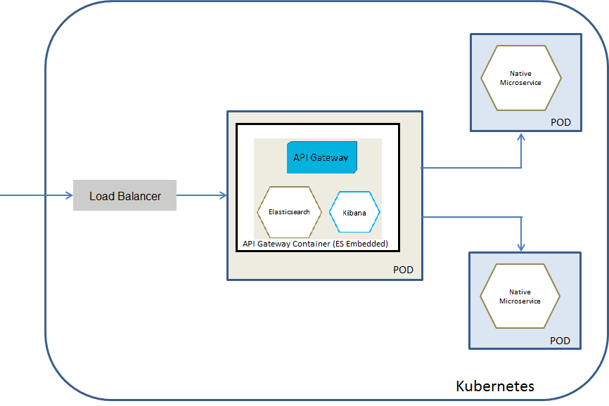

## Deploying API Gateway Pod with API Gateway Containers having embedded elasticsearch

You can select this deployment model if you want API Gateway as a Kubernetes service protecting the native services deployed to Kubernetes. Here, API Gateway runs in dedicated pods, the API Gateway container has elasticsearch and kibana embedded. API Gateway routes the incoming API requests to the native services. The invocation of the native services by the consumers happens through APIs provisioned by API Gateway.

The below figure depicts the API Gateway Kubernetes service deployment model where you have a single API Gateway pod that contains API Gateway container with elasticsearch and kibana embedded. 



Do the following steps to deploy API Gateway Kubernetes pod that contains elasticsearch embedded in API Gateway container

1. Ensure that vm.max_map_count is set to a value of at least 262144 to run an Elasticsearch container within a pod. If you don't have access to the environment setup you can do this in an init container as follows:

    ```
	  initContainers:
	  # NOTE:
	  # To increase the default vm.max_map_count to 262144
	  # https://www.elastic.co/guide/en/elasticsearch/reference/current/docker.html#docker-cli-run-prod-mode
	  - name: increase-the-vm-max-map-count
		image: busybox
		command:
		- sysctl
		- -w
		- vm.max_map_count=262144
		securityContext:
		  privileged: true
	  # To increase the ulimit
	  # https://www.elastic.co/guide/en/elasticsearch/reference/current/docker.html#_notes_for_production_use_and_defaults
	  - name: increase-the-ulimit
		image: busybox
		command:
		- sh
		- -c
		- ulimit -n 65536
		securityContext:
		  privileged: true
   ```   
2. Run the following command to deploy API Gateway in the Kubernetes setup:

   ```
   kubectl create -f api-gateway-deployment-embedded-elasticsearch.yaml
   ```
   
   Ensure that you have specified the required information such as container name, the path to your API Gateway image stored in a docker registry and container port in the Kubernetes sample file [api-gateway-deployment-embedded-elasticsearch.yaml](api-gateway-deployment-embedded-elasticsearch.yaml). For details on Kubernetes YAML files, see Kubernetes documentation. 
   
   This now pulls the image specified and creates the API Gateway pod with API Gateway container in which Elasticsearch is embedded. 
   
Run the command `kubectl get pods` to view the pods created.

